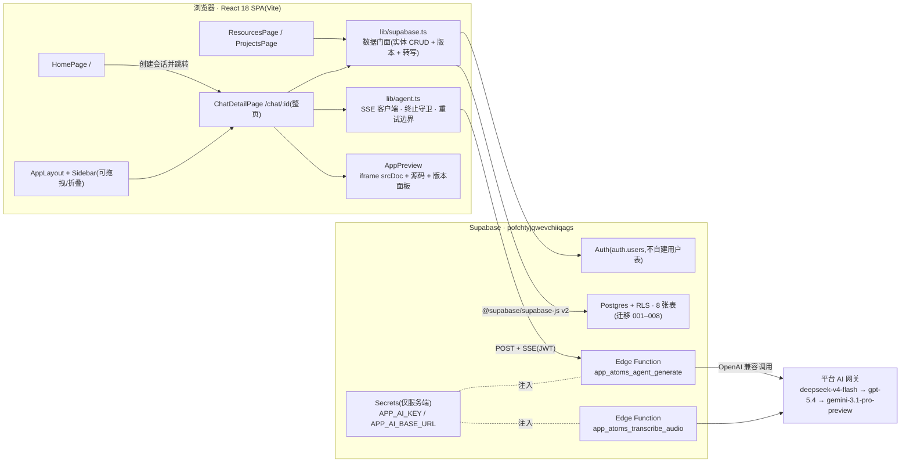
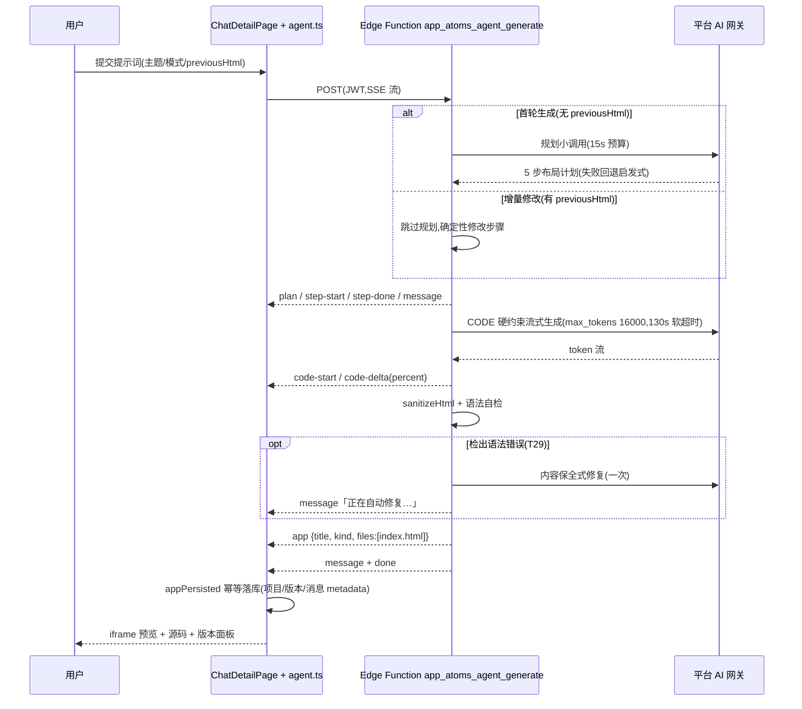

# 系统设计文档

> 项目:Atoms Demo — 类 Atoms 平台的对话式智能体应用生成平台
> 状态:**T1–T29 全部完成**(2026-09-20)。Supabase 项目 `pofchtyjqwevchiiqags` 已连接(Auth + Postgres/RLS + Edge Functions);
> 真实 AI 生成、增量修改、版本管理、会话归档、产物语法自检均经真实链路验证(T29 全链路走查 32/32,总耗时 49.5s)。
> 本文档为 T30 系统性重建版,全部描述以当前代码与线上数据库实测状态为准。

## 1. 产品定位与设计理念

还原 Atoms 官网产品形态的智能体应用平台,核心链路:**输入创意 → 分步计划 → 流式生成 → 实时预览 → 落库回放 → 项目管理 → Publish**。产物为可直接运行的单文件 HTML 应用(iframe srcDoc + sandbox),会话/消息/项目/版本全量持久化于 Supabase。

三条贯穿实现的设计原则:

1. **端到端真实可用**:计划、生成、落库、回放、版本、导出全部走真实链路;无占位按钮、无假成功态。演示模式产物也真实落库,仅以 `is_demo`/metadata 标记可辨识。
2. **故障透明,禁止静默回退**(T6 教训):云端模式下数据层与 Edge Function 错误显式抛出并透出到对话流;演示智能体只能由用户在失败卡**主动点击**触发(T23),绝不作为自动兜底——兜底会掩盖线上故障。
3. **收敛优先于重试**(T28):「是否重跑」以**产物是否已交付(`app` 事件)**为唯一判据。产物到手后,任何流截断/缺失 `done` 都补发 `done` 正常收敛,绝不整轮重跑;只有未交付产物的瞬时故障才有限重试。

## 2. 系统总览



数据访问统一收敛在 `src/lib/supabase.ts`:`isSupabaseConfigured`(依据 `VITE_SUPABASE_URL`/`VITE_SUPABASE_ANON_KEY`)决定远程或演示分支,两分支返回同构实体,页面无感切换。AI 密钥只存在于 Edge Function Secrets,前端不持有任何第三方密钥。

## 3. 技术栈

| 层 | 选型 | 说明 |
|----|------|------|
| 框架 | React 18 + TypeScript + Vite 5 | SPA,react-router-dom v6;构建含 sitemap 与 `/`、`/blog/` 预渲染 |
| 样式 | Tailwind CSS 3 + shadcn/ui | 全站白色浅色体系(T27),语义变量 `bg-popover`/`border-border` 等 |
| 布局 | react-resizable-panels | 侧边栏拖拽调宽/折叠、对话 + 预览分栏 |
| 数据 | @supabase/supabase-js v2、@tanstack/react-query、sonner | 数据门面 + 查询缓存 + Toast |
| 后端 | Supabase | Auth、Postgres/RLS、Edge Functions(Deno/TS) |
| AI | 平台 AI 网关(OpenAI 兼容) | 主 `deepseek-v4-flash`,备 `gpt-5.4`、`gemini-3.1-pro-preview`;转写 `scribe_v2` |
| 测试 | Playwright 1.52.0 + Node + Python | 浏览器全链路走查(T7–T29)、后端 E2E/质量门槛脚本 |

## 4. 模块划分

### 4.1 前端(app/frontend)

| 模块 | 职责 | 关键文件 |
|------|------|----------|
| 应用框架 | Provider 组合、路由、布局容器 | `src/App.tsx`、`src/components/layout/AppLayout.tsx` |
| 侧边栏 | 导航、工作区选择器、最近对话(收藏/重命名/删除/归档过滤)、新会话、登录入口 | `src/components/layout/Sidebar.tsx` |
| 首页 | 欢迎视图、公告条、提交即创建会话并跳转详情页、模板占位快捷区 | `src/pages/HomePage.tsx` |
| 详情页 | 对话 + 应用查看器整页布局、SSE 生成、队列续跑、失败卡、显式演示模式、版本面板、在线编辑、导出、刷新恢复、归档守卫 | `src/pages/ChatDetailPage.tsx` |
| 输入区 | `+` 菜单(附件/引用/MCP 等分组)、`#` 引用四类、主题菜单(七主题+搜索)、构建/目标模式、语音、发送/停止 | `src/components/chat/ChatComposer.tsx` |
| 消息渲染 | 用户/助手气泡、计划卡、代码进度、失败卡、【演示模式】标识 | `src/components/chat/ChatMessage.tsx` |
| 应用查看器 | iframe 预览、源码查看、HTML 编辑器、历史版本面板、HTML 导出、Publish 入口 | `src/components/preview/AppPreview.tsx` |
| 智能体客户端 | Edge Function SSE 消费、**T28 终止守卫(`deliveredApp`)**、瞬时故障退避重试、错误透传、本地演示智能体 | `src/lib/agent.ts` |
| 演示产物 | 6 类真实可运行单文件 HTML 应用、主题色板、模板占位替换、`isDemo` 标记 | `src/lib/demo-apps.ts` |
| 数据访问 | 实体类型与 CRUD、版本 API、转写调用、`status=eq.active` 过滤、演示兜底、Edge Function URL | `src/lib/supabase.ts` |
| 认证 | Supabase 会话、资料/工作区加载与 JWT 自愈、登录守卫 | `src/contexts/AuthContext.tsx` |

### 4.2 后端(app/backend)

| 组件 | 职责 |
|------|------|
| `functions/app_atoms_agent_generate/index.ts` | AI 生成主管线:意图识别 → 布局规划 → 硬约束代码生成 → 产物净化 → **语法自检与自动修复(T29)**;增量修改模式(T25);模型通道降级(T23);130s 软超时;SSE 事件流 |
| `functions/app_atoms_transcribe_audio/index.ts` | 语音转写(scribe_v2),仅登录用户,音频 ≤10MB/≤60s |
| `migrations/001–008` | 建表/RLS/触发器/索引、app_html、模板占位、默认空间唯一、注册触发器、收藏、版本与元数据、归档状态、会话关联项目回填 |
| `scripts/` | 部署(`deploy_function.py`/`set_secrets.py`/`run_sql.py`)与验证(`e2e_verify.py`、`test_agent_e2e.py`、`test_t9_baseline.py`、`test_transcribe.py` 等) |

## 5. 路由结构

| 路由 | 页面 | 布局 | 说明 |
|------|------|------|------|
| `/` | HomePage | AppLayout(侧边栏) | 纯欢迎视图;提交即创建会话并跳转详情页 |
| `/chat/:conversationId` | ChatDetailPage | **整页**(T16,不保留全局侧边栏) | 对话 + 查看器;历史直达;归档会话提示并回落首页(T26) |
| `/resources` | ResourcesPage | AppLayout | 发现/模板 + 分类过滤、体验/克隆/占位生成 |
| `/projects` | ProjectsPage | AppLayout | 全部/已收藏、收藏、回放 |
| `/auth/callback` `/auth/error` | AuthCallback / AuthError | 独立 | OAuth/邮箱确认回调与错误展示 |
| `*` | Navigate `/` | — | 兜底重定向 |

## 6. 智能体生成管线(Edge Function)

四段式管线,替代「一个提示词直出 HTML」的粗放做法:

1. **意图识别 `analyzeIntent`**(确定性规则):提炼应用类型(游戏/数据/工具/内容/落地页)、内容分区、关键功能;模糊需求注入默认假设。
2. **布局规划**:独立非流式小调用(500 tokens、15s 预算)产出恰好 5 步 JSON 计划——布局结构与 Flex/Grid 策略(多分区桌面横排、≤900px 纵向堆叠)、视觉规范(间距刻度 8/12/16/24、圆角 8–16px、卡片分层)、交互与响应式;超时/解析失败回退 `fallbackSteps` 启发式计划,规划失败不阻断生成。
3. **代码生成 `CODE_SYSTEM` 硬约束**:页面级结构禁用绝对/固定定位(浮层仅限有边界局部且父容器 `position:relative`);多分区 flex/grid 独立卡片;@media 移动端适配必做;canvas 定宽元素 `max-width:100%`;可点元素 ≥40px;正文禁止 Markdown 原始符号。`max_tokens:16000` + 行数预算控制在平台时限内。
4. **产物净化 `sanitizeHtml`**:剥离围栏与前后杂文,仅保留 `<!DOCTYPE html>…</html>` 完整文档。
5. **语法自检与自动修复(T29,`findScriptSyntaxErrors`)**:交付前提取内联 `<script>` 用 `new Function` 做**纯语法校验(只编译、不执行)**;检出错误(如模型产出的非法 `const` 声明)时发起一次**内容保全式**AI 修复重试——「仅修正 JavaScript 语法错误,保持功能、结构、文案与标记字符串完全不变」,修复结果重新净化并复检后交付,`syntaxFixed` 记入函数日志;修复后仍有错则照常交付(校验不阻塞产品链路)。

**增量修改模式(T25)**:请求体携带 `previousHtml`(前端透传当前版本完整 HTML)且含 `</html>` 时,跳过规划小调用,改用确定性修改步骤,CODE 提示注入「当前版本完整 HTML(在此基础上修改,除本次修改点外保持原样)」——避免整页重生成丢失既有功能。T29 实测:第二轮产物同时保留 R1/R2 双标记特征。

### 6.1 生成时序图



## 7. SSE 事件协议

请求体:`{ prompt, theme?, mode?, previousHtml? }`;`Authorization: Bearer <access_token>`(登录态由服务端校验)。

| 事件 | 载荷 | 语义 |
|------|------|------|
| `message` | `{ content }` | 过程性文案(计划完毕提示、重试提示、修复提示、完成总结) |
| `plan` | `{ steps: string[] }` | 执行计划(恰好 5 步),前端渲染计划卡 |
| `step-start` / `step-done` | `{ index }` | 计划步骤状态推进 |
| `code-start` | `{ fileName }` | 代码生成开始 |
| `code-delta` | `{ delta, percent }` | 代码流式增量与进度百分比 |
| `app` | `{ app: { title, kind, files: [{ name, content, language }] } }` | **产物交付**(单文件 HTML);前端收到即置 `deliveredApp` |
| `done` | `{ stopped }` | 唯一正常终止信号 |
| `error` | `{ message }` | 失败透出(HTML 不完整/超时/截断时服务端主动发送) |

服务端保证:超时(`SOFT_DEADLINE_MS = 130_000`)、流中断、HTML 不完整时主动 `error` + `done` 收尾,不静默截断;非 SSE 失败以 HTTP 状态 + JSON `{ error }` 返回。

## 8. 错误与重试策略

```
上游调用(Edge Function 内部)
 ├─ 单模型瞬时错误 → 同模型重试 → 下一通道(gpt-5.4 → gemini-3.1-pro-preview)
 ├─ 全部通道失败 → HTTP 502「平台 AI 网关故障,请稍后重试」(显式,不静默兜底)
 └─ 全部通道均「余额不足」→ HTTP 402(确定性账户错误,专属文案)

前端 agent.ts(lib/agent.ts)
 ├─ 终止守卫(T28):deliveredApp=true 后——
 │    · 流结束缺 done → 补发 done 收敛;读取异常 → 补发 done,错误仅 console.warn
 │    · 绝不整轮重跑(修复「代码 100% 后重新规划再生成」死循环)
 ├─ 重试边界:仅未交付产物的瞬时故障(5xx/429/网络)自动重试,
 │    指数退避 1.2s→2.4s→4.8s,整轮上游调用封顶 4 次(MAX_ATTEMPTS=4)
 ├─ 确定性错误(402 等)只透出失败,不重试不降级
 └─ 失败 → 失败卡(真实错误文案 + 指引)
      ├─ 「重新生成」原地续跑(不重复落库用户消息)
      └─ 「使用演示模式生成」(T23,用户主动,唯一演示入口)
```

**幂等落库(T28)**:同一生成轮次 `appPersisted` 守卫,重复 `app` 事件(服务端重发/重试竞态)只落库一次项目与版本快照,避免重复项目与重复版本号。

**错误如实落库**:失败信息作为助手消息写入 `messages`,历史回放可见真实失败原因;Supabase 已配置时绝不静默回退演示智能体,仅未配置时使用本地演示管线。

## 9. 版本管理机制(T25)

- 表 `project_versions(project_id, user_id, version_number, source, label, app_html)`,`UNIQUE(project_id, version_number)` 兜底并发;RLS 仅 SELECT/INSERT(快照不可变,无 UPDATE/DELETE 策略)。
- `source` 枚举 `generation | edit | rollback`(006 CHECK 约束),四个写入时机:
  1. 首次生成 `createProject` 成功 → v1(`generation`,「首次生成」);
  2. 增量生成 `updateProjectAppHtml` 成功 → `generation`(label=本次修改摘要);
  3. 在线编辑保存 → `edit`;
  4. 回滚 → 先以目标内容 `updateProjectAppHtml`,再新建 `rollback` 版本(**不改写历史**)。
- 版本号 = `fetchProjectVersions` 首条 `version_number + 1`。
- 查看器「历史版本」面板:列表(时间/来源/字节数)、点击仅切换预览**不落库**、一键回滚带确认、Blob 导出 HTML。
- 读取韧性:AbortController 真取消 + 单次 4s 超时 + 最多 3 次重试 + `versionsLoading` 加载态(修复挂起请求排队放大延迟)。

### 9.1 原子版本写入(T31)

- 迁移 `009_atomic_version_write.sql` 新增 RPC `app_write_project_version(p_project_id, p_app_html, p_source, p_label)`,把原本「读最新版本号 → 更新 `projects.app_html` → 插入 `project_versions`」三步收敛为**单个数据库事务**,消除项目已更新而快照缺失(半写状态)的窗口。
- 取号与并发:`UNIQUE(project_id, version_number)` 为最终兜底;并发写入只有一个事务提交成功,失败方读取最新版本号后重试(有限次数),不会产生重复版本号,也不会写坏既有快照。
- 事务边界内任一语句失败(含客户端在写入途中断开连接)整体回滚,项目 `app_html` 与版本快照保持一致;`source` 仍受 `generation|edit|rollback` CHECK 约束。
- 验收:`t31-transaction-injection.mjs` 20/20——并发唯一、无半写状态、RLS 隔离(他人项目/版本不可写不可读)、中断注入后一致性;评审账号亦通过原子 RPC 写入 v1 快照(`t31_reviewer_account.py` 10/10)。

## 10. 刷新恢复机制

| 恢复项 | 机制 |
|--------|------|
| 会话与消息 | `messages` 全量回放;助手消息按 `metadata`(`{isDemo, plan}`)恢复【演示模式】标识与计划卡(T25) |
| 关联项目 | `projects.conversation_id`(008 回填迁移,FK→conversations ON DELETE SET NULL)按会话查最新项目,自动加载查看器(T16) |
| 演示徽标 | `projects.is_demo` 恢复查看器「演示模式」徽标(T25);真实产物显示「生成应用」徽标(T29 验证) |
| 版本链 | 刷新后重新拉取 `project_versions`,v1–v4 稳定恢复(T25 走查 26/26、T29 32/32) |
| 归档会话 | 查询统一 `status=eq.active`;归档会话旧链接直达提示「该会话已归档」并回落首页,数据不删除(T26) |
| 工作区 | AuthContext 恢复 profile/spaces,JWT 过期自愈;最近对话按当前工作区过滤(T7) |

## 11. 数据模型概要

8 张表:profiles、spaces、projects、conversations、messages、community_apps、templates、project_versions;迁移 001–008 已全部在线生效并经 `information_schema`/`pg_policies`/`pg_indexes` 实测核验。**字段、RLS 策略、索引与触发器的完整定义见 [docs/data-model.md](data-model.md)。**

## 12. 认证与工作区

- 复用 Supabase `auth.users`,不自建用户表、不建第二套登录;`profiles` 仅为扩展信息。
- 注册触发器 `handle_new_user`(004,security definer)自动创建 profile 与默认工作区,`on conflict do nothing` + 003 部分唯一索引保证幂等防并发;`hashtext & 2147483647` 修复负数下标 500(T8)。
- 登录守卫:云端模式未登录发起对话/克隆/模板生成先弹登录框,不以非法 UUID 写库(T6)。
- 工作区隔离:会话与项目按 `space_id` 归属;侧边栏「最近」按当前工作区过滤;无工作区发起对话被引导创建(T7)。

## 13. 关键技术决策

| 决策 | 选择 | 理由 |
|------|------|------|
| 用户体系 | 复用 Supabase `auth.users` | 平台规范,不自建用户表 |
| 未配置兜底 | 演示模式(内存数据) | 仅限本地未配置环境变量;云端模式禁止静默回退 |
| 产物形态 | 单文件 HTML + iframe srcDoc | 可落库/回放/克隆/导出;多文件工程化列 P3 |
| 产物运行隔离 | iframe `sandbox` 白名单 + `srcdoc`(opaque origin)+ CSP(T31) | AI 产物不可触达宿主 DOM/存储/Cookie 与登录令牌 |
| 版本写入 | 单事务 RPC `app_write_project_version`(T31) | 消除「项目已更新、快照缺失」半写状态;UNIQUE 兜底并发 |
| 生成模型 | deepseek-v4-flash 主 + 双备通道降级 | 复杂提示词 20–55s 稳定产出,满足平台时限;单点供应商故障不再直接失败 |
| 终止判据 | `app` 事件交付即收敛(T28) | 流截断≠生成失败;重跑代价远大于补发 done |
| 增量协议 | `previousHtml` 透传完整 HTML | 复用单文件模型,避免重生成丢失既有功能 |
| 版本快照 | 不可变 + 回滚新建版本 | 可审计;UNIQUE 兜底并发 |
| 归档 | `status` 字段仅隐藏 | 不删除任何数据,可逆 |
| 部署溯源 | 构建期注入 `window.__ATOMS_BUILD__`(T31) | 线上可直接核对部署产物对应提交 SHA/ref/构建时间 |
| 跨组件联动 | window CustomEvent | 项目页/侧边栏与详情页解耦刷新 |

## 14. 已知边界与演进方向

- 详情页「云/文件/增长」页签为空态占位;编辑器已支持在线编辑(T25),页签真实化列 P2。
- 附件当前仅记录文件名,内容进上下文列 P2;MCP 为本地配置 + 状态徽标,真实协议对接列 P2。
- BYOK(用户自带模型 Key)已评估暂缓,列 P1。
- 回归脚本清单与结果、部署与发布流程见 [docs/deployment.md](deployment.md);产品使用规范见 [docs/usage.md](usage.md)。
